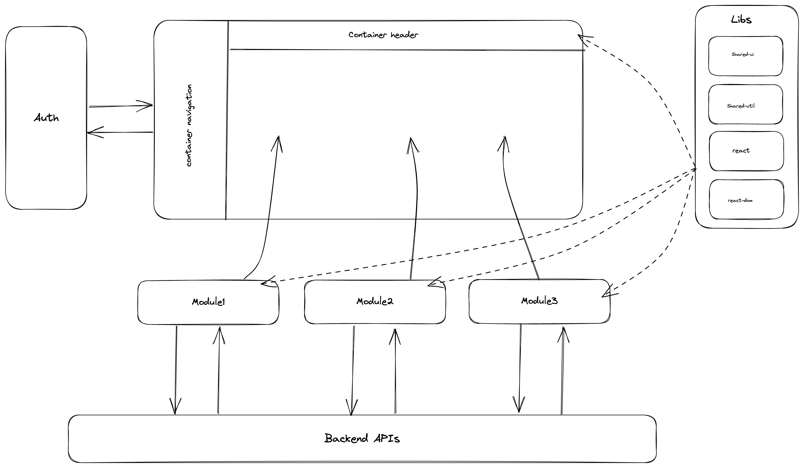

# Nx micro-frontend example

## Architecture

## Setup steps

- Clone the repo
- run `yarn install`
- run `yarn nx run container:serve --devRemotes=module1,module2,module3`
- Open http://localhost:4200/ in your browser
